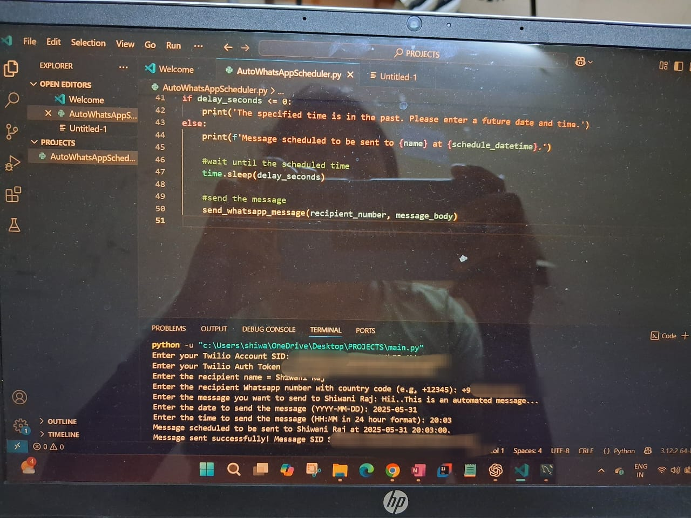
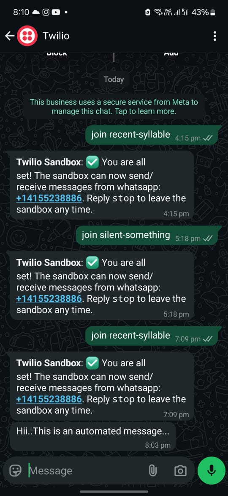

# AutoWhatsAppScheduler

**AutoWhatsAppScheduler** is a Python script that allows you to schedule and send WhatsApp messages automatically at a specified date and time using the Twilio API. 

## Features
- User-friendly command line interface to input recipient details and message.
- Schedule messages to be sent on a future date and time.
- Uses Twilio WhatsApp API for reliable message delivery.
- Error handling for invalid dates and Twilio API errors.

## Requirements
- Python 3.x
- Twilio account with WhatsApp sandbox enabled
- `twilio` Python package (`pip install twilio`)

## How to Use

1. Clone the repository or download the script.

```bash
git clone https://github.com/shiwaniraj203/AutoWhatsAppScheduler.git
cd AutoWhatsAppScheduler
Install required package:

bash
Copy code
pip install twilio
Run the script:

bash
Copy code
python AutoWhatsAppScheduler.py
Enter the required inputs when prompted:

Your Twilio Account SID

Your Twilio Auth Token

Recipient’s WhatsApp number (with country code, e.g. +1234567890)

Message to send

Date and time to schedule the message (YYYY-MM-DD and HH:MM in 24-hour format)

The script will wait and send the message at the scheduled time.


## Screenshots

### 1. VS Code Input/Output


### 2. WhatsApp Message (via Twilio)



Author
Shiwaniraj203
GitHub: https://github.com/shiwaniraj203